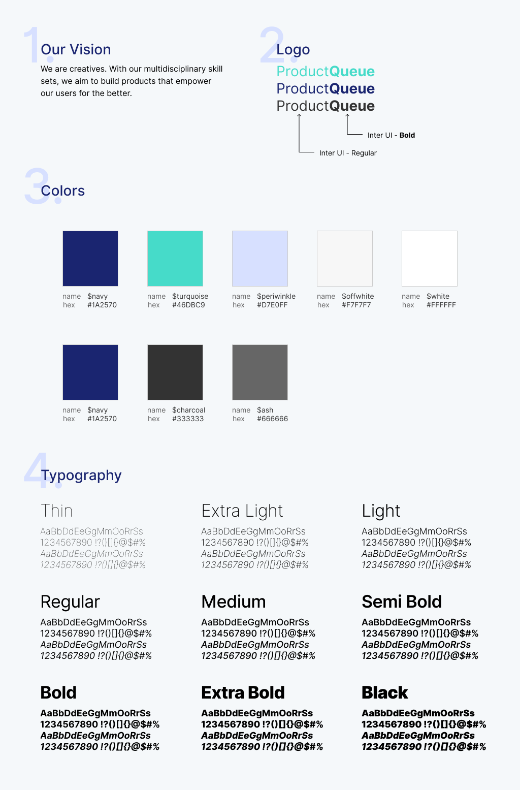

# landing-page--cedric

The landing page for the Lambda School PT Build Week Product**Queue** project.
Product**Queue** is a web app to make organizing and searching products easier.

## Getting Started

These instructions will get you a copy of the project up and running on your local
machine for development and testing purposes. See deployment for notes on how to
deploy the project on a live system.

### Prerequisites

To get started with this project, the following tools are needed to be installed:

 - Node.js / npm - https://nodejs.org/en/download/
 - LESS - http://lesscss.org/

### Development

This project uses vanilla JavaScript and HTML, however, it does make use of CSS
preprocessing through LESS.

All CSS styling should be done in the appropriate LESS files under the `less/`
directory. To have these changes be applied in real-time, use the following
command:

```sh
$ less-watch-compiler less css index.less
```




## Deployment

Netlify makes it super easy to deploy a static website from GitHub. I highly
recommend the following article to see how you can deploy your site from a GitHub
repo:

[A Step-by-Step Guide: Deploying on Netlify](https://www.netlify.com/blog/2016/09/29/a-step-by-step-guide-deploying-on-netlify/)


## Contributing
Pull requests are welcome. For major changes, please open an issue first to discuss what you would like to change.


## License

[MIT](LICENSE.md)
